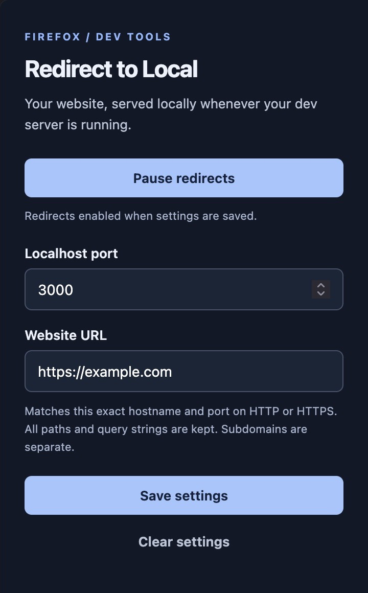

# Redirect to Local

[](https://github.com/itsberkelium/redirect-to-local/releases/latest)
[](https://github.com/itsberkelium/redirect-to-local/actions/workflows/tests.yml)


A Firefox and Chrome extension that saves a website URL and localhost port. When you visit that website, it checks your local server and redirects only if it responds.

**[Install from Firefox Add-ons](https://addons.mozilla.org/en-US/firefox/addon/redirect-to-local/)**



For example, with URL `https://example.com` and port `3000`:

```text
https://example.com/test?a=b → http://localhost:3000/test?a=b
```

## Install

Install [Redirect to Local from Firefox Add-ons](https://addons.mozilla.org/en-US/firefox/addon/redirect-to-local/), then open the extension from Firefox's extensions menu. Enter your localhost port and website URL, and click **Save settings**.

## Load locally for development

### Chrome

1. Run `npm run build:chrome` (Node.js 18+ and the `zip` command required).
2. Open `chrome://extensions` and enable **Developer mode**.
3. Click **Load unpacked** and select this project's `dist/chrome` folder.
4. Open the extension popup and save your website URL and localhost port.

Chrome 109 or later is required. The Chrome Web Store upload package is `dist/redirect-to-local-chrome-0.1.2.zip`. Chrome support is not yet published to the Chrome Web Store.

Chrome Manifest V3 does not allow ordinary extensions to block requests while checking localhost. The Chrome build observes top-level GET requests, checks localhost, and then navigates the tab. The original website may begin loading or briefly appear during the check. It abandons the redirect if settings change or the tab navigates away. Same-document navigation without a network request does not trigger a new check.

### Firefox

1. Open `about:debugging#/runtime/this-firefox`.
2. Click **Load Temporary Add-on…** and select this project's `manifest.json`.
3. Open **Redirect to Local** from Firefox's extensions menu.
4. Enter your localhost port and website URL, then click **Save settings**.
5. Start your local HTTP server and visit the configured website.

Temporary add-ons are removed when Firefox restarts. Permanent installation in standard Firefox requires Mozilla signing, including for privately distributed add-ons. Firefox 142 or later is required.

## Behavior

- The two settings are stored locally in Firefox. Clear settings to turn redirects off.
- Use **Pause redirects** to temporarily stop redirects without clearing your settings, then **Resume redirects** to enable them again. Pause status is saved across browser restarts. Saving or clearing settings does not change pause status. Pausing affects future navigations, not pages already open.
- URLs without a scheme are accepted. Saving a URL with a path keeps its origin; matching applies to every path on that host.
- Matches the exact hostname and explicit non-default port, across HTTP and HTTPS. `example.com` does not match `www.example.com` or other subdomains.
- Preserves the requested path, URL encoding, and query string. Redirect destinations use `http://localhost:PORT`.
- Checks the local root URL with a `HEAD` request before each matching navigation. Any HTTP response, including 404, 405, or 500, means the server is reachable. No response within 1.5 seconds, or a connection failure, leaves navigation unchanged.
- Redirects ordinary top-level GET navigations only. Form POSTs, embedded frames, and background requests are not redirected.
- Localhost cannot be used as the source, preventing redirect loops. HTTPS-only local servers are not supported.
- Availability is checked before redirecting; a server that stops immediately afterward can still result in a connection error.

## Permissions and privacy

HTTP/HTTPS host access allows matching the website you configure and checking localhost. Firefox may ask you to grant website access; redirects require that access. The extension inspects top-level navigation URLs, stores the two settings and pause status, and sends a HEAD request to localhost while enabled. It has no analytics or external service.

The Firefox background uses the [asynchronous blocking webRequest API](https://developer.mozilla.org/en-US/docs/Mozilla/Add-ons/WebExtensions/API/webRequest/onBeforeRequest). Chrome uses a service worker with a [non-blocking request observer](https://developer.chrome.com/docs/extensions/reference/api/webRequest) and the tabs API. Both builds share settings and availability-check code; saved preferences are local to each browser.

## Verify

Run `npm test` (Node.js 18+; no dependencies). Tests cover URL matching and preservation, validation, failed and timed-out probes, settings changes, and simultaneous navigations.

GitHub Actions runs the tests on Node.js 22 and 24 for pushes and pull requests. You can also run the workflow manually from the Actions tab.

For a browser smoke test, start `python3 -m http.server 3000`, save `example.com` and `3000`, and visit `https://example.com/test?a=b`. The address should become `http://localhost:3000/test?a=b` (a local 404 is expected unless `/test` exists). Stop the server and visit the remote URL again; it should stay remote.

Build separate packages with an explicit list of extension files:

```sh
npm run build:chrome
npm run build:firefox
npx web-ext lint --source-dir dist/firefox
```
